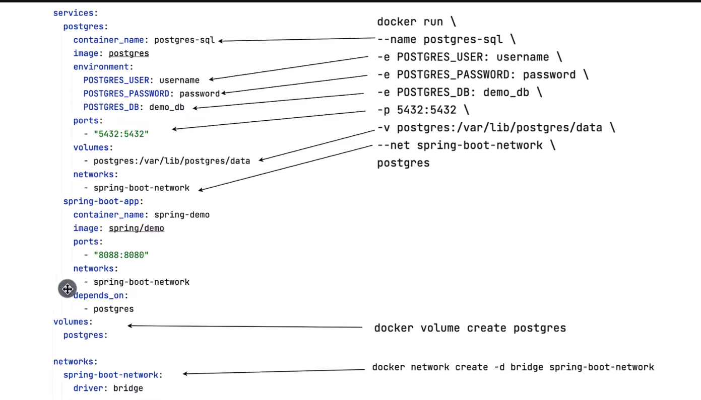

# What is a container?

- Lightweight, standalone and executable software package that includes everything needed to run a piece of software.
- Containers are designed to provide a consistent and reproducible environment across different platforms and development stages.
- Simplifies development, deployment and scaling.

# Containers benefits

- consistency.
- Portability.
- Resource Efficiency.
- Scalability.
- Versioning and Rollback.
# Where are containers?

- Container repository (e.g. nexus repository).
- Private repositories.
- Public repository https://hub.docker.com/

# Virtual Machine VS Docker Container

## Virtual Machine (VM):
- Hypervisor-Based: VMs are created and managed by a hypervisor, which is a layer of software that abstracts physical hardware and allows multiple operating systems (OS) to run on the same physical machine simultaneously.
- Isolation: Each VM simulates a complete hardware environment, including CPU, memory, storage, and network interfaces, providing strong isolation between different VMs.
- Resource Overhead: VMs typically have higher resource overhead because they include a full OS along with the application and its dependencies.
- Boot Time: VMs generally have longer boot times because they need to start a complete OS.
- Image Size: VM images are usually larger compared to Docker images because they contain a complete OS.
- Portability: VMs are less portable than Docker containers due to differences in underlying hardware and hypervisor configurations.
## Docker Container:
- Containerization: Docker containers provide a lightweight form of virtualization that packages applications and their dependencies into standardized units called containers.
- Docker Engine: Containers are managed by the Docker Engine, which runs on top of the host operating system and interacts with the host kernel's functionality, such as namespaces and groups.
- Isolation: Containers share the host OS kernel but are isolated from each other through namespaces, providing process-level isolation.
- Resource Efficiency: Containers have lower resource overhead compared to VMs because they share the host OS kernel and don't require a separate OS for each container.
- Boot Time: Containers generally have faster startup times compared to VMs because they don't need to boot a complete OS.
- Image Size: Docker images are typically smaller compared to VM images because they only contain the application and its dependencies, not a full OS.
- Portability: Docker containers are highly portable across different environments, as long as they run on a compatible host OS and Docker Engine.

# What is a Docker Container?

- A set of layers of images.
- Mostly LINUX BASE IMAGE.
- Application image always on TOP.

# Docker commands

- `docker pull postgres`  pull latest image from docker hub https://hub.docker.com/
- `docker pull redis:6.2` pull a specific version
- `docker images`  list all images
- `docker run -e POSTGRES_PASSWORD=password postgres`  run and create a container, but each time it will create a new container
- `docker run --name mehrez-postgres -e POSTGRES_PASSWORD=password postgres` same as above command but a container with a custom name
- `docker run -d --name mehrez-postgres -e POSTGRES_PASSWORD=password postgres`  run it in a detached mode
- `docker ps`  list active containers
- `docker ps -a`  list all containers
- `docker stop 5cf560d89a63`  stop container
- `docker start 94425a1f5329`  start and run an existing container
- `docker logs 94425a1f5329` list the latest logs
- `docker logs -f 94425a1f5329` keep listening to all upcoming logs
- `docker rm 389c84d4a863` remove container
- `docker rmi 389dc84d4a863` remove image
- `docker exec -it 94425a1f5329 psql -U postgres`    execute commands inside the container in an interactive mode
  
  psql (16.2 (Debian 16.2-1.pgdg120+2))
  Type "help" for help.

postgres=# \l                 //to list databases

                                                      List of databases
Name    |  Owner   | Encoding | Locale Provider |  Collate   |   Ctype    | ICU Locale | ICU Rules |   Access privileges   
-----------+----------+----------+-----------------+------------+------------+------------+-----------+-----------------------
postgres  | postgres | UTF8     | libc            | en_US.utf8 | en_US.utf8 |            |           |
template0 | postgres | UTF8     | libc            | en_US.utf8 | en_US.utf8 |            |           | =c/postgres          +
|          |          |                 |            |            |            |           | postgres=CTc/postgres
template1 | postgres | UTF8     | libc            | en_US.utf8 | en_US.utf8 |            |           | =c/postgres          +
|          |          |                 |            |            |            |           | postgres=CTc/postgres
(3 rows)

postgres=# create database mehrez;
CREATE DATABASE

postgres=# exit

# Docker Volumes

- Virtual file system(e.g. postgres [/var/lib/postgres/data]): Data lost when restarting or removing a container.
- Physical file system(e.g. [/user/username/path/data]): Folder in physical file system(host) is mounted into the virtual file system of Docker(container). Data is automatically replicated.

## Volumes types

- Host volumes: `docker run -v /user/username/path/data:/var/lib/postgres/data` You decide where on the host this reference is made.
- Anonymous Volumes: `docker run -v /var/lib/postgres/data` Foreach container, a folder is generated and gets mounted(Automatically created by Docker).
- Named volumes: `docker -v custom-name:/var/lib/postgres/data` You can just reference the volume by name(You don't have to know the path). Named volumes is the one you should be using in production.

# How we used to work before containers?

- Different installation process on each OS.
- Hard to reproduce the same issues on different environments.
- Many steps if something goes wrong.

# Life after containers

- Isolated environments.
- Package with the required configurations.
- One same command to install and run the app.
- Run on different environments and versions.

# How we used to deploy before containers

- Server configuration needed: Versions conflicts.
- Text documents for deployment: Misunderstanding.

# How we used to deploy after containers

- Developers and Operations work together as a team.
- No environment configuration is needed on the server.

# Docker ports

- Multiple containers can run on a Host.
- A host has certain ports available.
- Conflict when using the same port on your host.

## Expose ports
`docker run --name postgres-sql -p 5433:5432 -e POSTGRES_PASSWORD=password -v /home/mehrez-hrizi/docker/volumes/postgres/data:/var/lib/postgres/data postgres`  5433(host) 5432(container)

After exposing the port, we update the application.yml to connect to the postgresql container

`spring.datasource.url=jdbc:postgresql://localhost:5433/demo_db`

# Dockerfile

-  Package a java application : this will create a jar file inside the target folder `./mvnw clean package`
- Write a docker file in the app root.

`FROM openjdk:17-jdk` This line specifies the base image for the Docker container. It indicates that the Docker image will be built on top of the official OpenJDK 17 image (openjdk:17-jdk), which contains the Java Development Kit (JDK) version 17. This base image provides the necessary runtime environment for running Java applications.

`WORKDIR /app` This line sets the working directory inside the Docker container to /app. Subsequent commands in the Dockerfile will be executed relative to this directory. If the directory does not exist, Docker will create it.

`COPY target/app-dockerization-demo-0.0.1-SNAPSHOT.jar /app/demo.jar` This line copies the JAR file of the Java application (app-dockerization-demo-0.0.1-SNAPSHOT.jar) from the local file system into the Docker container. It places the JAR file in the /app directory inside the container and renames it to demo.jar.

`EXPOSE 8080` This line specifies that the Docker container will expose port 8080 to allow communication with the outside world. It does not actually publish the port; it only documents that the container will listen on this port. Port 8080 is commonly used for web applications, but it's up to the user to map this port to the host machine when running the container.

`CMD ["java", "-jar", "demo.jar"]` This line specifies the command to run when the Docker container starts. It runs the Java application by executing the java command with the -jar option, followed by the name of the JAR file (demo.jar). This command launches the Java Virtual Machine (JVM) and executes the specified JAR file as the main application entry point.

- Build the image  `docker build -t spring/demo .`

After running this command, we have this error:

`org.postgresql.util.PSQLException: Connection to localhost:5433 refused. Check that the hostname and port are correct and that the postmaster is accepting TCP/IP connections.
at org.postgresql.core.v3.ConnectionFactoryImpl.openConnectionImpl(ConnectionFactoryImpl.java:342) ~[postgresql-42.6.2.jar!/:42.6.2]`

# Docker Networking

- First, we have to update the application.yml, since there is no connection between the 2 containers, (postgres-sql) is the name of the container, 5432 is the port inside the container
  `spring.datasource.url=jdbc:postgresql://postgres-sql:5432/demo_db`
- Second, we have to package the app and build our image again:  `./mvnw clean package`    `docker build -t spring/demo .`
- Third, Check the list of available networks: `docker network ls`

| NETWORK ID  | NAME  | DRIVER |SCOPE |
|-------------|---|--------|---|
| 75381ce9c240 | bridge  | bridge |   local |
| 4e3fafa4e41b | host  | host   |   local |
|        828fc7d95137     | none  | null   | local   |

- Fourth, Create a network: `docker network create spring-boot-net`

| NETWORK ID  | NAME  | DRIVER |SCOPE |
|-------------|---|--------|---|
| 75381ce9c240 | bridge  | bridge |   local |
| 4e3fafa4e41b | host  | host   |   local |
|        828fc7d95137     | none  | null   | local   |
|a350dbe8cd79|spring-boot-net|bridge|local|

- Fifth, Connect the postgres-sql container to the network: `docker network connect spring-boot-net postgres-sql`
- Sixth, Run and create the app container and specify the network in one command: `docker run --name spring-boot-container -p 8088:8080 --network spring-boot-net spring/demo`

# Docker Compose

- Is a tool for defining and running multi-containers application, in order to manage applications consisting of multi services that depend on each other.
- Simplified service management.
- Reproducible builds.
- Ease of collaboration
- Isolation and environment consistency.
- Simplified networking.
- Easy scaling.
- Simplified logging and monitoring.
- Integration with orchestration platforms: Docker Swarm, Kubernetes...

